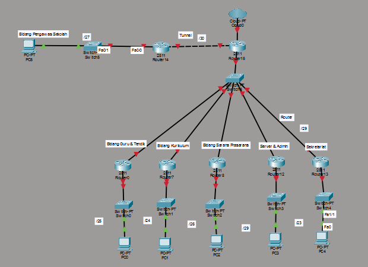
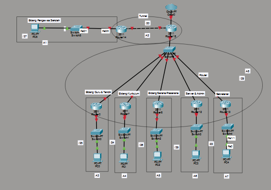
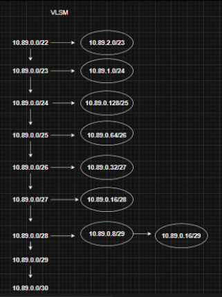
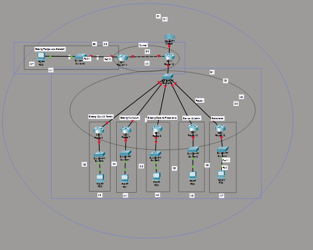
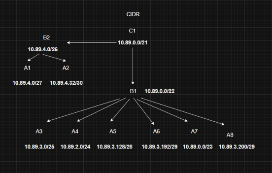

# Tugas-1-Jarkom_Khumaidi-Kharis-Az-zacky_049

# TOPOLOGI

# SUBNETING

**IP Prefix:** `10.89.0.0/22`  
Total Host: **772** host

| Subnet                              | Kebutuhan Host | Netmask |
|------------------------------------|---------------|---------|
| Bidang Guru & Tendik               | 95 host       | /25     | 
| Bidang Kurikulum                   | 220 host      | /24     |
| Bidang Sarana Prasarana            | 45 host       | /26     | 
| Bidang Pengawas Sekolah (Cabang)   | 18 host       | /27     | 
| Server & Admin                      | 6 host        | /28     | 
| Sekretariat                        | 380 host      | /23     | 
| Router                    | 6 host        | /29     | 
| Tunnel                      | 2 host        | /30     | 
| **TOTAL**                           | **772 host**  | **/22** | 

## VLSM

## Skema Alokasi VLSM

| Col | Subnet | Kebutuhan | Prefix | Available Host | Mask | NID | Broadcast | IP Available | Gateway |
|:----|:--------------------------|:-----------:|:-------:|:----------------:|:----------------:|:---------------:|:---------------:|:--------------------------:|:---------------:|
| A7 | Sekretariat | 380 | /23 | 512 | 255.255.254.0 | 10.89.2.0 | 10.89.3.255 | 10.89.2.1 - 10.89.3.254 | 10.89.2.1 |
| A4 | Bidang Kurikulum | 220 | /24 | 256 | 255.255.255.0 | 10.89.1.0 | 10.89.1.255 | 10.89.1.1 - 10.89.1.254 | 10.89.1.1 |
| A3 | Bidang Guru & Tendik | 95 | /25 | 128 | 255.255.255.128 | 10.89.0.128 | 10.89.5.255 | 10.89.0.129 - 10.89.5.254 | 10.89.0.129 |
| A5 | Bidang Sarana Prasarana | 45 | /26 | 64 | 255.255.255.192 | 10.89.0.64 | 10.89.5.127 | 10.89.0.65 - 10.89.5.126 | 10.89.0.65 |
| A1 | Bidang Pengawas Sekolah | 18 | /27 | 32 | 255.255.255.224 | 10.89.0.32 | 10.89.0.63 | 10.89.0.33 - 10.89.0.62 | 10.89.0.33 |
| A6 | Server & Admin | 6 | /29 | 8 | 255.255.255.248 | 10.89.0.8 | 10.89.0.15 | 10.89.0.9 - 10.89.0.14 | 10.89.0.9 |
| A8 | Router | 6 | /29 | 8 | 255.255.255.248 | 10.89.0.16 | 10.89.0.23 | 10.89.0.17 - 10.89.0.22 | 10.89.0.17 |
| A2 | Tunnel | 2 | /30 | 4 | 255.255.255.252 | 10.89.0.0 | 10.89.0.3 | 10.89.0.1 - 10.89.0.2 | 10.89.0.1 |
| **TOTAL** |  | **772** | **/22** | **1024** |  |  |  |  |  |

## CIDR

## Skema Alokasi CIDR

| Sub | Subnet | Kebutuhan | Prefix | Mask | NID | Broadcast | IP Available | Gateway |
|:----|:--------------------------|:-----------:|:-------:|:----------------:|:---------------:|:---------------:|:--------------------------:|:---------------:|
| A1 | Bidang Pengawas Sekolah | 32 | /27 | 255.255.255.224 | 10.89.4.0 | 10.89.4.31 | 10.89.4.1 - 10.89.4.30 | 10.89.4.1 |
| A2 | Tunnel | 4 | /30 | 255.255.255.252 | 10.89.4.32 | 10.89.4.35 | 10.89.4.33 - 10.89.4.34 | 10.89.4.33 |
| A3 | Bidang Guru & Tendik | 128 | /25 | 255.255.255.128 | 10.89.3.0 | 10.89.3.127 | 10.89.3.1 - 10.89.3.126 | 10.89.3.1 |
| A4 | Bidang Kurikulum | 256 | /24 | 255.255.255.0 | 10.89.2.0 | 10.89.2.255 | 10.89.2.1 - 10.89.2.254 | 10.89.2.1 |
| A5 | Bidang Sarana Prasarana | 64 | /26 | 255.255.255.192 | 10.89.3.128 | 10.89.3.191 | 10.89.3.129 - 10.89.3.190 | 10.89.3.129 |
| A6 | Server & Admin | 8 | /29 | 255.255.255.248 | 10.89.3.192 | 10.89.3.199 | 10.89.3.193 - 10.89.3.198 | 10.89.3.193 |
| A7 | Sekretariat | 512 | /23 | 255.255.254.0 | 10.89.0.0 | 10.89.1.255 | 10.89.0.1 - 10.89.1.254 | 10.89.0.1 |
| A8 | Router | 8 | /29 | 255.255.255.248 | 10.89.3.200 | 10.89.3.207 | 10.89.3.201 - 10.89.3.206 | 10.89.3.201 |
